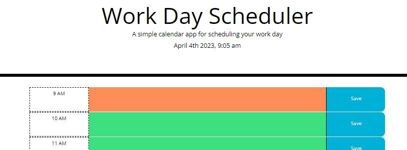
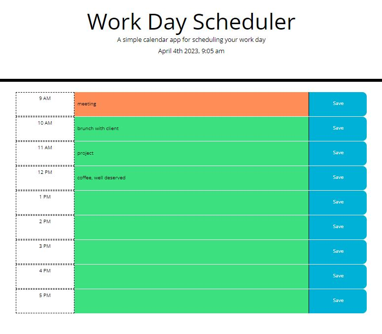

# Workday planner app

## Description

One business day planner app. It displays current time in the header. It has a business hours from 9-5, a space to enter a task for each hour and a button to save it. 

Please remember to click "Save" button. Once task is saved, it stays even when the browser is refreshed. 

Hours are is color-coded. Hours in the past are presented in grey, current hour - in orange, future hours - in green, so the colouring of the day will look different depending on the time of the day you are looking at it. 

## Languages/technologies/frameworks/libraries used
- HTML
- CSS
- JavaScript
- jQuery
- Moment.js
- Local storage

## Installation

There is no installation needed.

## Usage

Please view deployed site [here](https://astarem.github.io/workday-planner-app/) . Remember to click "Save" button once you enter/delete/update your task.
